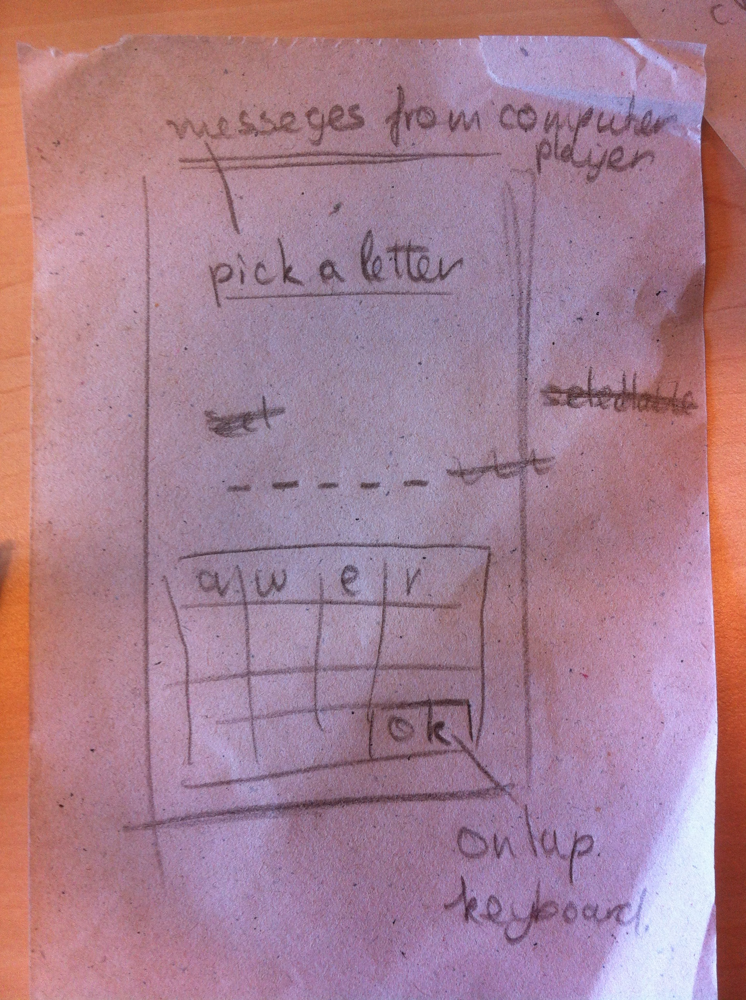
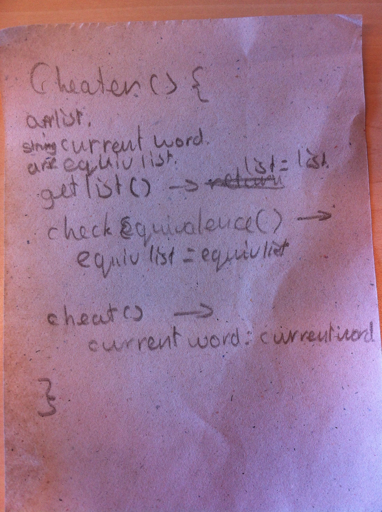

project5
========

Evil hangman, a game of hangman where the computer secretly changes the word to defeat the human player

features
--------

- The game of hangman
- A secretly cheating computer system
- live computer monologue

Frameworks Languages & libraries
--------------------------------

- java
- android sdk

Models
------

- Hangman: a model that does all of the backend needed to play the game of hangman (class vars are saved local) also contains game settings
- HiScores: a model that makes a hightscore list and saves it to the local memory

Model Classes (code design)
---------------------------

Hangman
-------

**Class:              Hangman()**

Class var:          String playerName

Class var:          int wordLength

Class var:          int tries

Class var:          Array wordList

Class var:          String currentWord

Class var:          String cMonologue

**Method:             getList()**

* // sets the list array with all the possible words

**Method:             settings()**

* // sets all of the settings with standard settings or user preferences

**Method:             setWord(wordLength)**

* // picks a psuedo randomn word from the list by set length

**Method:             checkUserInput()**

* // returns the guessed letter and place(s) in the string, return false when the guessed letter is not in the word

HiScores
--------

**Class:              HiScores**

Class var:          ArrayList scores

* // the constructor will retrieve the scores

Class var:          Array top10

**Method:             addScore()**

* // adds a score to the scores arraylist

**Method:             setTop10()**

* // sets the top 10 from the scores list

EvilHangman
-----------

**Class:              EvilHangman()**

Class var:          Array list

Class var:          Array equivList

Class var:          String currentWord

Class var:          String cMonologue

**Method:             getList()**

* // sets the list array with all the possible words

**Method:             checkEquivalence()**

* // sets the equivList array by checking for possibilities that are equivilant to the guess the user made

**Method:             cheat()**

* // sets the current word giving the user the hightest possible chance to lose

Images
------

Schets van het scherm waar hangman in gespeeld word:

Opzet classes evil hangman (niet meer nodig):

Design doc
----------

https://moqups.com/svandenhout/RbfktZxW
